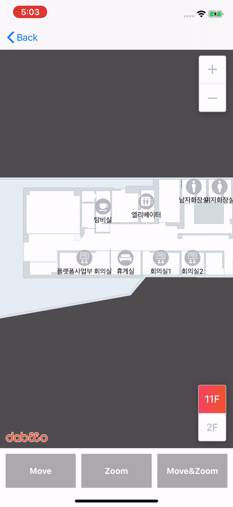

## Map Animation

SDK API 통해 지도 애니메이션을 사용하는 뷰 컨트롤러 입니다.




## Sample Code

* MapAnimationViewController.swift

  * MapView Options 설정

    ``` 	swift
    mapOptions.isMoveAnimation = true
    mapOptions.isZoomAnimation = true
    ```

  * Move

    ``` swift
    self.mapView.mapCenter = DMPoint.init(x: CGFloat.random(in: 0..<self.mapInfo.size.width),
                                          y: CGFloat.random(in: 0..<self.mapInfo.size.height),
                                          z: 0.0)
    ```

  * Zoom

    ``` swift
    self.mapView.zoom = CGFloat.random(in: self.mapOptions.minZoom..<self.mapOptions.maxZoom)
    ```

  * Move&Zoom

    ``` swift
    let point: DMPoint = DMPoint.init(x: CGFloat.random(in: 0..<self.mapInfo.size.width),
                                      y: CGFloat.random(in: 0..<self.mapInfo.size.height),
                                      z: 0.0)
    let zoom = CGFloat.random(in: self.mapOptions.minZoom..<self.mapOptions.maxZoom)
            
    self.mapView.setView(point, zoomLevel: zoom, animation: true)
    ```
